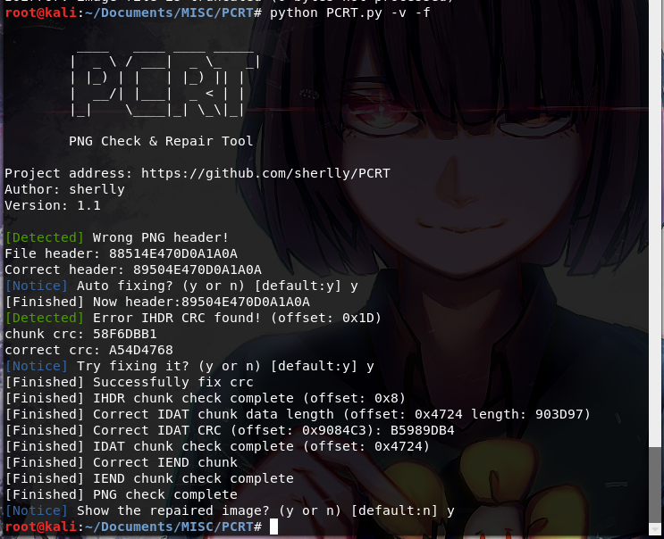

#recover 
## **【原理】**

## **【目的】**

## **【环境】**

Python 

## **【工具】**

<del>pngcheck, 010 editor</del> PCRT

## **【步骤】**

首先修复png头部，然后发现IHDR的crc校验未通过，直接修改crc为正确值可以看到图片，但是没有flag。

这时候有两种情况，图片高度或宽度，既然正常显示说明宽度没问题，调整图片高度或者爆破高度得到正确高度为1500，得到flag。

我在按照学长方法试的时候发现了另外一种方法...

有一款可以一款自动化检测修复PNG损坏的取证工具: [PCRT](https://github.com/sherlly/PCRT) 

用法在README中...

然后就能在output.png中看到flag了

## **【总结】**

